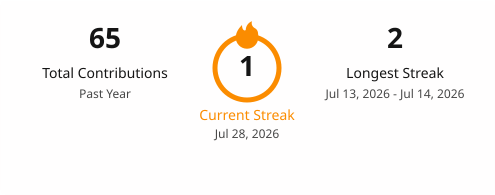

<h1 align="center">Hi 👋, I'm Denys</h1>
<h3 align="center">Full Stack Developer - React/Next.js & Node.js/Nest.js</h3>

Building things the whole team can rely on, not just personal scripts 🐈

---

### 🚀 What I work on

- Full-stack architecture: design systems, real-time features, and data-layer migrations and scaling
- AI-agent tooling for engineering teams: agent context setup, workflow automation, code-review integration
- Freelance projects across e-commerce, booking platforms, and payment integrations

---

### 🔨 Tech Stack

**Frontend**

**Backend**

**Databases & Cloud**

**Tools**

---

### 📈 GitHub Stats

  

  
  

